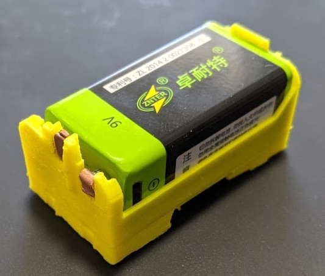
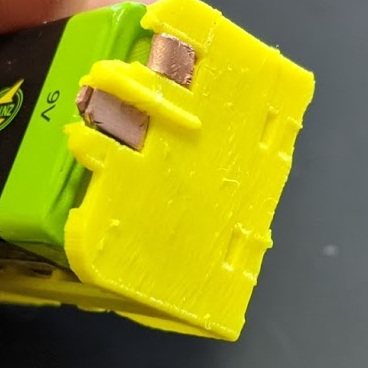
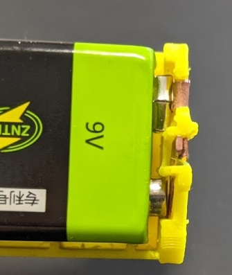

# 9V battery caddy for use with Lego® Powered Up!® Hub 88009

A 3D-printable 9V battery caddy compatible with Lego® Powered Up!® Hub 88009.

See [my related blog post for
details](http://blog.ringerc.id.au/2021/05/rechargeable-lithium-ion-battery-caddy.html).

**This is not a clone or duplicate of any Lego product or design. It is an
entirely original design that replaces the 6xAAA battery holder in the Lego
Powered Up hub with something more sensible.** Read this description before you
send a DMCA notice, ok?

The caddy is intended for use with 9V (PP3) form factor Li-ion USB-rechargeable
battery packs. These packs are now widely available.

Unlike traditional NiMH batteries, these packs generally continue to deliver a
steady 9V until their low-voltage cut-off trips and they shut off. So the hub
won't complain about low batteries and refuse to work as soon as the battery is
half discharged. They're convenient to recharge using a micro-USB cable. They
(should) integrate all the annoying control circiutry for charge control,
voltage buck/boost, overcharge protection, overcurrent protection, undervoltage
protection, etc. And they're fairly cheap, wheras buying the ICs or modules to
build your own is definitely not.

Enjoy. Let me know how you go.

## Acknowledgements

I used ["Batteries in OpenSCAD" by Thingiverse user
`roman_hegglin`](https://www.thingiverse.com/thing:155722) to supply a
convenient 9V model battery for preview and alignment purposes. I replaced my
own AAA battery model with his in the process.

[Philo](https://philohome.com/) has done tons of great write-ups on Lego stuff.
While I didn't use anything of his on this project, he was a great help in my
ongoing efforts to design an easy to make custom Powered Up compatible cable,
and my early success with driving standard hobby DC motors from the Powered Up
hub.
